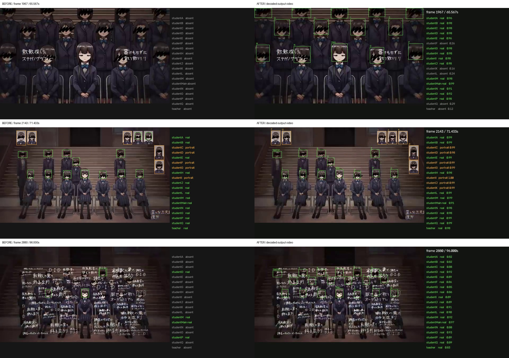
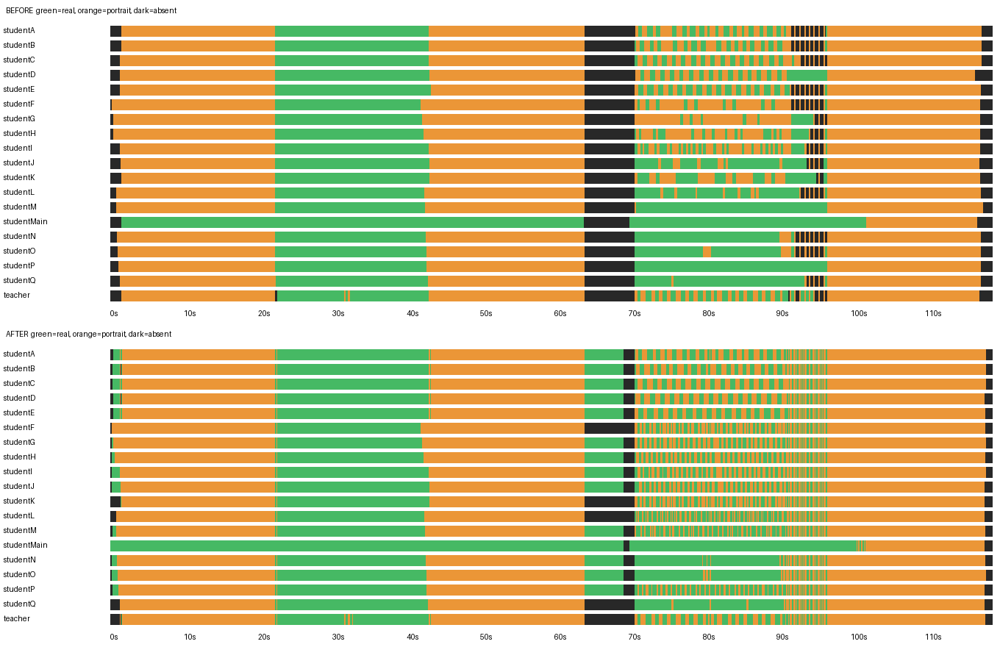

# 動画認識の改善・実測結果

対象: `video/original.mp4`、640×360、30fps、119.1秒、3,573フレーム。
19人それぞれを `real` / `portrait` / `absent` に分類します。

## 最終結果

元動画を目視して付けた正解ラベルで、旧方式と改善後の**全編解析・時系列処理後の結果**を比較しました。

| 評価対象 | 判定数 | 旧方式 | 改善後 |
|---|---:|---:|---:|
| 調整用33フレーム | 627 | 79.59%（499件） | 100%（627件） |
| 別に選んだ検証用22フレーム | 418 | 84.45%（353件） | 100%（418件） |
| 合計55フレーム | 1,045 | **81.53%（852件）** | **100%（1,045件）** |
| 全員の状態が一致したフレーム | 55 | 30 | 55 |

実体 `real` の再現率は64.17%から100%、適合率は92.88%から100%に改善しました。
正解は `labels.json`、誤りの内訳と混同行列は `baseline_metrics.json` と `improved_metrics.json` に保存しています。

**100%はこの55フレームのサンプル評価です。全3,573フレームに正解ラベルを付けた結果ではありません。**
単独・集合・拡大・実体と遺影の混在・歌詞の遮蔽・暗転を含めて選んでいます。
テンプレート抽出に使用した0、120、840、1920、3120フレームは評価対象から除外しました。
顔を識別できる程度に見える人物を対象とし、体だけが映る人物は不在としました。
プロファイルには、画面内の顔領域が25%未満の場合は対象外にする制限があります。

## 実際に回した改善ループ

1. **旧方式を全編実行**。画面全体から独立に顔を探す方式では、拡大場面の見逃し、遺影を実体として拾う混同、歌詞による遮蔽を確認しました。
2. **動画由来の顔画像と座席位置を追加**。SIFTとRANSACで拡大・移動を推定して位置を正規化し、遺影を別レイヤーとして照合。調整用33フレームの画像単位の一致率は90.11%でした。
3. **画面端で切れた顔を可視部分で照合**。同じ画像単位の評価が96.01%になりました。
4. **白い歌詞を除外した重み付き相関と単独ポーズの位置合わせを追加**。調整用・検証用とも画像単位で100%になりました。
5. **全編出力を確認して時系列処理を修正**。旧設定の切り替えコスト5では、意図された2フレームの表示などが消え、調整用で10件の見逃しが残りました。コスト1に変更し、全編を再デコードしました。状態が変わる230フレームでは顔照合と検出枠も再計算し、保存済みスコアとの一致を確認しています。最終動画・CSV・SQLを再生成した結果が上表です。

途中結果は `iteration1_metrics.json`、`iteration2_metrics.json`、`iteration3_metrics.json`、
`before_temporal_fix_metrics.json` にあります。画像単位の途中評価と全編の最終評価を区別してください。

## 出力動画・ログの確認



上から65.567秒の拡大、71.433秒の実体と遺影の混在、96秒の歌詞の遮蔽。
右側は**生成済み動画を実際にデコードして取り出した画像**です。
さらに冒頭の38〜48フレームの切り替えを `transition_review.jpg` で確認しました。



確認した項目:

- 最終確認動画: H.264、960×420、30fps、119.1秒。全3,573フレームをデコードできました。
- 音声: 元動画のAACをコピー。長さ119.118367秒、5,130音声フレームを維持しています。
- 認識ログ: 3,573×19＝67,887行。全行の状態が保存した最終認識結果と一致しました。
- SQL: 異なる319文を実際の `database.db` の読み取り専用接続で実行し、構文エラーがないことを確認しました。3人以上の条件で `OR` が欠ける既存不具合も修正しました。
- ユニットテスト: 黒画面、文字遮蔽、画面端の顔、短い実表示、時系列処理、SQL実行を含む8件が成功しました。

全編の短い状態区間も `output_audit.json` に記録しています。元動画自体に短い切り替えが多数あるため、短い区間を一律に誤検出とは扱っていません。

## 再実行

リポジトリ直下で実行します。

```powershell
python -m pip install -r requirements.txt
python make_SQL_yaml_by_video.py --scores-json evaluation/improved_full.json
python evaluate_detection.py evaluation/improved_full.json --output evaluation/improved_metrics.json
python -m unittest -v
```

旧方式の全編スコアの再計算:

```powershell
python evaluation/run_baseline_parallel.py
python evaluate_detection.py evaluation/baseline_full.json --output evaluation/baseline_metrics.json
```

成果物の検査・比較画像の再生成にはPillowも必要です。

```powershell
python -m pip install pillow
python evaluation/audit_outputs.py
```

顔画像・座席配置はこの動画用です。他の動画への汎用精度を検証したものではありません。
出力動画は `video/OpenCV_processing_process.mp4`、ログは `video/recognition.csv`、SQLは `SQL.yaml` です。
